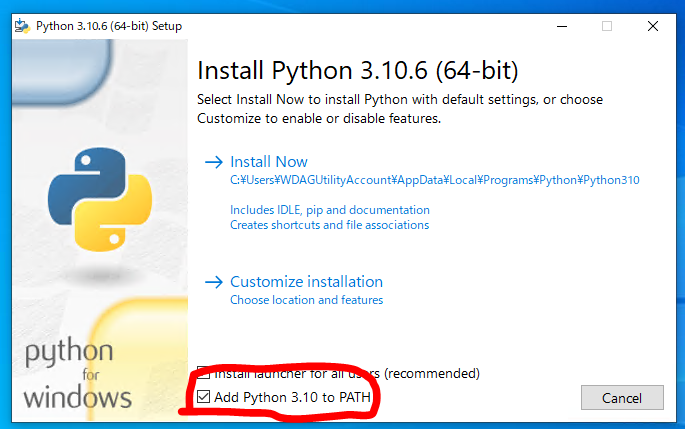

# しっぽコン (for VRChat)

Nintendo Switch のジョイコンを腰付近に取り付け、  
実際の自然な体の揺れをジャイロ情報から取得し、  
ExParams経由でVRChatアバターの尻尾を揺らそうシステム

つくっているひと
* [@aruma256](https://twitter.com/aruma256)
* [@aruma256_vr](https://twitter.com/aruma256_vr)

# 必要なもの

* PCVR環境(動作確認はWindows10のみ)
    * PCはBluetooth通信できること
* アバター改変・アップロード環境
* ジョイコン L または R

# 使用方法

## 導入手順（初回のみ）

1. アバターに「尻尾を上下左右に動かすアニメーションブレンド」を設定し、ExpressionMenu の2軸コントロールから操作できるようにしておく。
    * [【VRChat】意図した方向に尻尾を動かす方法（Fx_2Axis）](https://signyamo.blog/vrchat_2axis/) （しぐにゃもブログ 様）  
    ↑ わかりやすくて助かりました
1. [Python](https://www.python.org/) をインストールしておく。（未インストールの場合）
    * **インストール時、PATH追加を推奨**
    
    * （将来的にはこの手順は不要にしたい）
1. [ここ](https://github.com/aruma256/Shippo-Con/releases/tag/v0.1.0)からzipをダウンロードし、展開する
1. `setup.py` をダブルクリックし実行する
    * PyPIから必要なライブラリをインストールしてくれます
1. `config.json` をテキストエディタで開き、ExParamsの名前をアバターのものに変更する

## 使用時

1. ジョイコン L または R をPCとペアリングする
1. `main.py` をダブルクリックし実行する
1. `Joy-Con L を使う` または `Joy-Con R を使う` をクリックし、揺れを検出できていることを確認する
1. ジョイコンを装着する
1. VRChatのアバターに反映されていることを確認する
1. 左右・上下反転や振れ幅の調整をする

# コツなど

* 初期位置がずれた場合、ジョイコンのスティックを押し込むとリセットできます
* 現状、意図的に揺らすというよりも、自然な体の揺れをそのまま反映させる という方針で作っています
    * 意図的に揺らす場合、振れやすさを低めに設定すると良さそうです
* [ツイートすると開発者を支援できます](https://twitter.com/intent/tweet?text=%23しっぽコンv0)

# 注意事項など

* ジョイコンのボタン操作をしないまま一定時間が経過すると、接続が切れます
* 接続できなくなったらPC側でジョイコンのペアリングを解除後、再ペアリングしてください
* 開発中のため不安定
* **使用は自己責任で**
* ジョイコンつけっぱなしで外出しないように...
